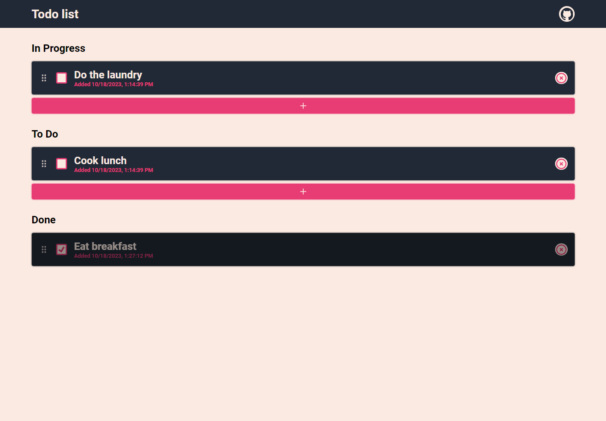

# Task Manager App

This is a simple task manager application built using React, Redux, SCSS, and focusing on a creative UX/UI approach.

This project is currently hosted on Vercel. You can access it at [task-manager-energywraith.vercel.app](https://task-manager-energywraith.vercel.app/).

## Technologies Used

- **TypeScript**: A typed superset of JavaScript that enhances the development experience and catches common programming mistakes.

- **React (Create React App)**: A popular JavaScript library for building user interfaces, scaffolded with Create React App for a streamlined development setup.

- **Redux Toolkit**: A set of utility functions for Redux, simplifying the process of writing efficient and maintainable Redux code.

- **React-Beautiful-DND**: A library for implementing drag-and-drop interactions in React applications, enhancing user experience.

- **SCSS**: A preprocessor scripting language that is interpreted or compiled into Cascading Style Sheets (CSS).

- **Jest**: A widely-used JavaScript testing framework, known for its simplicity and speed.


## Additional Features

- **Drag and Drop (Using react-beautiful-dnd)**: Tasks can be reordered by dragging and dropping.
- **LocalStorage integration**: The application utilizes Local Storage to save your task list. Your tasks will persist even after you close the browser.

## Getting Started

1. Clone the repository:

   ```bash
   git clone https://github.com/energywraith/todo-list.git
   ```

2. Install dependencies:

   ```bash
   cd todo-list
   npm install
   ```

3. Start the development server:

   ```bash
   npm start
    ```

4. Open your browser and go to http://localhost:3000 to view the app.

## Preview


